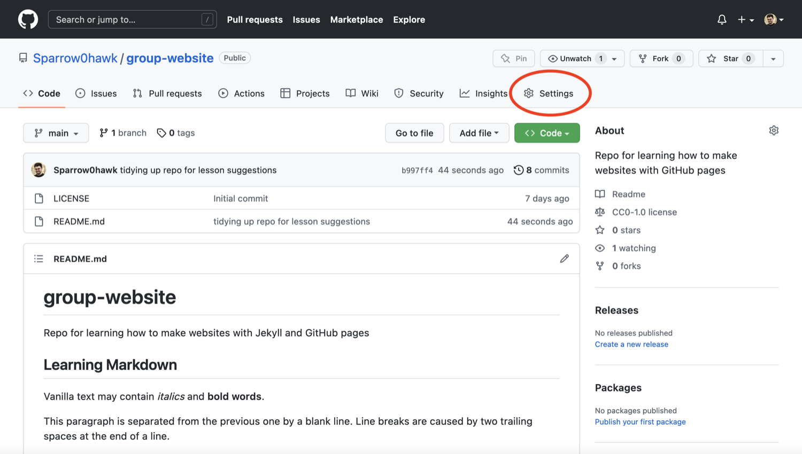
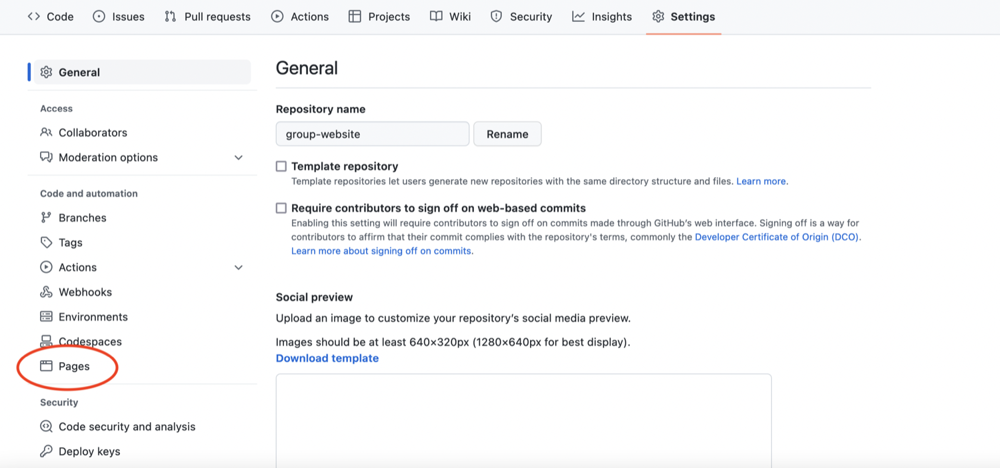
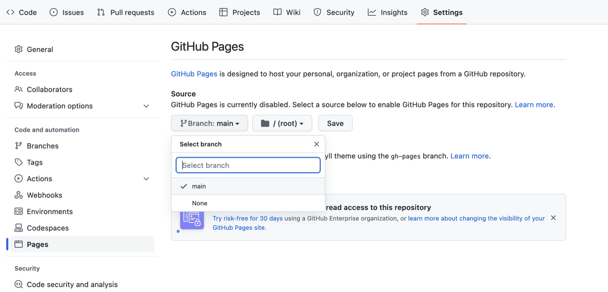
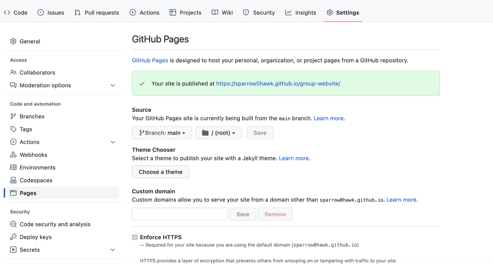
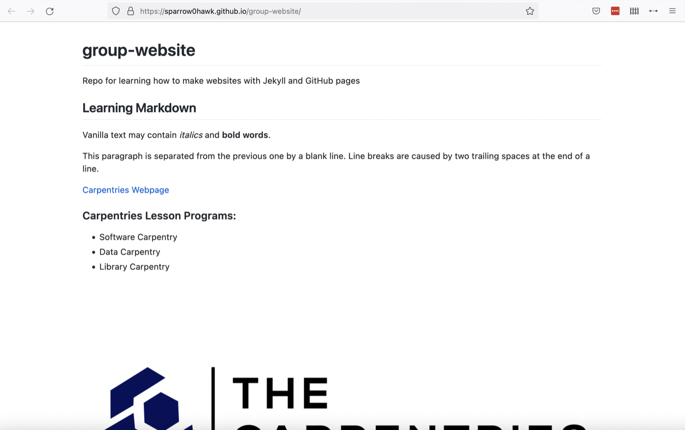

:::::::::::::::::::::::::::::::::::::: questions

- "How do I publish my page or a website on the Web via GitHub?"

::::::::::::::::::::::::::::::::::::::::::::::::

::::::::::::::::::::::::::::::::::::: objectives

- "Publish on the Web with GitHub Pages"

::::::::::::::::::::::::::::::::::::::::::::::::

GitHub has a service for making content available online called GitHub Pages.

## Publishing a Website With GitHub Pages
[GitHub Pages](https://docs.github.com/en/github/working-with-github-pages/about-github-pages) is a free website
hosting service by GitHub that takes files (Markdown, HTML, CSS, JavaScript, etc.)
from your GitHub repository which is configured as a website,
optionally runs the files through a build process, combines them and publishes them as a website.
Any changes you do to the files in your website's GitHub repository
will be rendered live in the website.

There are other services available to create and publish websites but one of the
main advantages of GitHub Pages is that you can version control your website and
therefore keep track of all your changes. This is particularly helpful for
collaborating on a project website. [GitLab](https://about.gitlab.com/),
[Codeberg](https://codeberg.org), [Sourcehut](https://sourcehut.org) and
[BitBucket](https://bitbucket.org) offer similar services.

Let's continue from the GitHub repository we have created in the previous
episode. One important file you should already have is `README.md`, which
will become the homepage of your project website.

## Enabling GitHub Pages
In order to tell GitHub that your repository contains a website that needs
rendering you need to configure GitHub Pages settings. You can do so from
your repository's _Settings_ page, as explained below.

You may have noticed that when we created our repository in previous episode,
by default GitHub created a branch called `main` and stored our files there.
We now need to tell GitHub Pages that this branch contains our website files.

:::::::::::::: callout

## What Is a Branch?

You may have never heard about Git branches and wonder what they are. A branch
is one version of your project (the files in your repository) that can contain
its own set of commits - you can have many branches (versions) of your
repository. The default branch automatically created with a new github
repository is called `main`.

::::::::::::

1. Click on the repository's `Settings` tab (the one with the little cog/gear icon)
as shown on the figure below:

    

2. On the menu on the left hand side, click on `Pages`

    

3. You will see that the GitHub Pages settings are currently disabled. Select branch `main` to
tell GitHub which branch to use as a source and
click `Save` to enable GitHub Pages for this repository.

    

4. The link to your repository's website will appear in the highlighted box
above. If you click the link  - your default browser will open and show your
project website. If this does not happen, you should manually open your
favourite web browser and paste the URL.

    

5. It may take a while (from a few seconds to a few minutes) for GitHub to
compile your website (depending on GitHub's availability and the complexity of
your website) and it may not become visible immediately. You will know it is
ready when the link appears in green box with a "tick" in front of the web
address (as shown in the figure below).

    

6. Once ready, you should see the contents of the `README.md` file that we
created earlier, rendered as a website.

    

:::::::::::::: callout

## Using Branch `gh-pages` for Websites

By convention, GitHub Pages uses branch called `gh-pages` to look for the
website content. By creating a branch with that name, you implicitly tell
GitHub that you want your content published and you do not need to configure
GitHub Pages in `Settings`. Once you create `gh-pages` from your current
branch (typically `main`, created by default when you created the repository),
you can then choose to delete the other branch to avoid any confusion about
where your content is stored.

::::::::::::::::::::::

Either of the above two approaches to turning a repository to a website will
give you the same result - the `gh-pages` approach is perhaps more common as
it favours convention over configuration.

## Understanding GitHub Pages' URLs

You may have noticed a slightly strange URL for your website appearing in that
green box with a "tick" in front of it.  This URL was generated by GitHub Pages
and is not random. It is formatted as
'https://GITHUB_USERNAME.github.io/REPOSITORY_NAME' and is formed by appending:

- your GitHub username or organisation name under which the repository is created (GITHUB_USERNAME)
- '.github.io/' (GitHub's web hosting domain)
- the repository name (REPOSITORY_NAME)

Because the repository name is unique within one's personal or organisational
GitHub account - this naming convention gives us a way of neatly creating Web
addresses for any GitHub repository without any conflicts.

:::::::::::::: callout

## Customising Domain
GitHub Pages supports using custom domains, or changing your site's URL from
the default 'https://GITHUB_USERNAME.github.io/REPOSITORY_NAME' to any domain
you own.
[Check out the documentation on configuring a custom domain for your GitHub Pages site](https://docs.github.com/en/free-pro-team@latest/github/working-with-github-pages/configuring-a-custom-domain-for-your-github-pages-site).

::::::::::::::::::::::

## Making Your Pages More Findable

On the right hand side of your repository on GitHub, you can see the details of
your repository under 'About'. It is good practice to update your repository
details with a brief description. This is also a place where you can put your
repository's Web URL (as not everyone will have access to your repository's
`Settings` to find it) and add descriptive topics or tags about the content or
technologies used in your repository or project.

You can edit the details of your repository by clicking on the little cog/gear
button as shown on the figure below.

By doing this, you add a link to the repository's website on your repository's
landing page and anyone (including yourself) can access it quickly when
visiting your GitHub repository.

::::::::::::::::::::::::::::::::::::: keypoints

- "GitHub Pages is a static site hosting service that takes files in various
   formats (Markdown, HTML, CSS, JavaScript, etc.) straight from a repository
   on GitHub, builds them into a website, and publishes them on the Web"
- "By convention, if you create a branch called `gh-pages` in your repository,
   it will automatically be published as a website by GitHub"
- "You can configure any branch of a repository to be used for website (it does
   not have to be `gh-pages`)"
- "GitHub publishes websites on special URLs formatted as
   'https://GITHUB_USERNAME.github.io/REPOSITORY_NAME'"

::::::::::::::::::::::::::::::::::::::::::::::::
